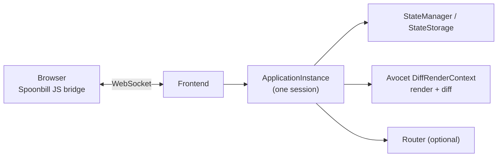
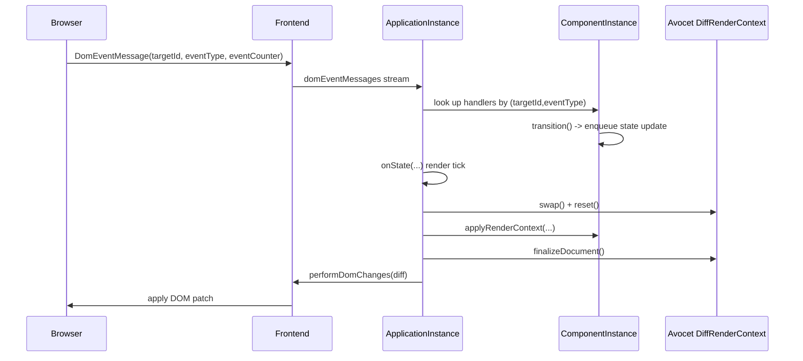
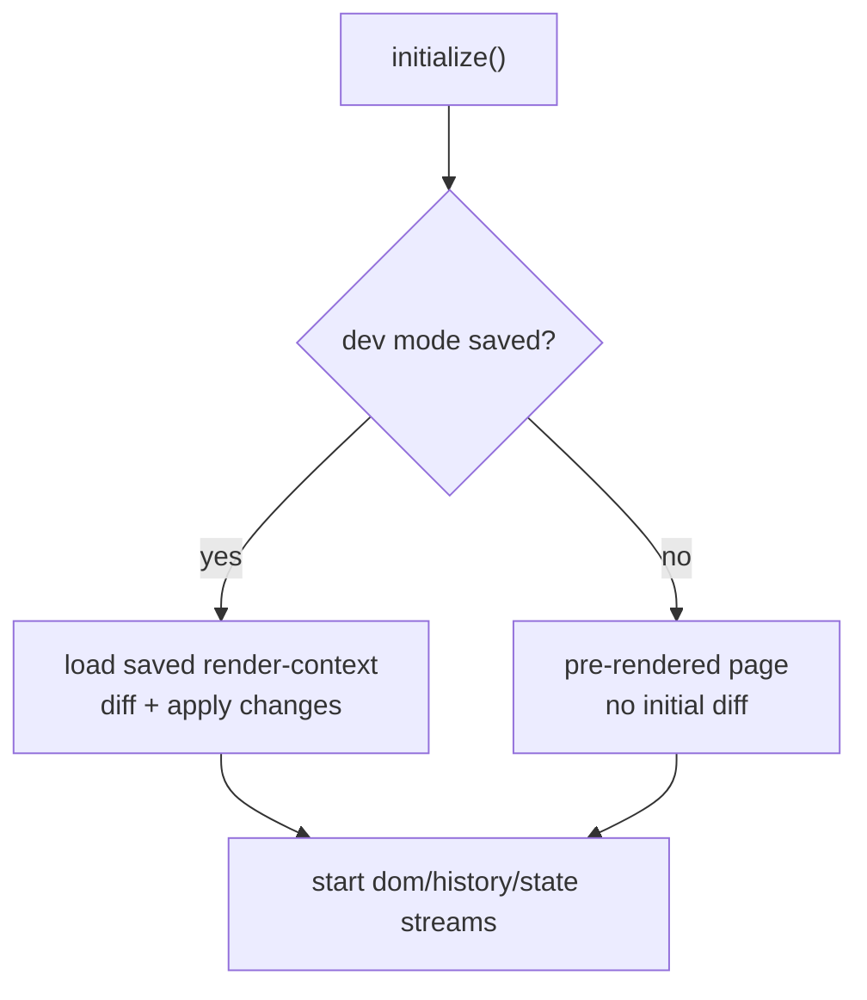

<p align="center">
  
</p>

# Spoonbill

Spoonbill is a server-side single-page application framework for Scala 3.
The browser runs a minimal JS bridge (~6kB). The server owns all application state and renders UI updates.
Client and server are combined into a single app without any REST protocol in the middle.

## Why?

* Lightning-fast page loading speed (~6kB of uncompressed JS)
* Comparable to static HTML client-side RAM consumption
* Indexable pages out of the box
* Routing out of the box
* Build extremely large app without increasing size of the page
* No need to make CRUD REST service
* Connect to infrastructure (DBMS, Message queue) directly from application

## Getting Started

```scala
// build.sbt
libraryDependencies += "com.natural-transformation" %% "spoonbill" % "<version>"
```

See the [examples](examples/) directory for working projects.

## Documentation

* [User guide](docs/user-guide.adoc)

## Design

Spoonbill is a server-side SPA framework built on top of **Avocet**.
The browser runs a small JS bridge.
The server owns the application state and renders UI updates.

### High-level architecture

Spoonbill keeps the "real app" on the server.
The client is responsible for:

- applying DOM changes sent by the server
- sending user events back to the server



### Core runtime pieces

- **`ApplicationInstance[F, S, M]`**: one running session. It owns the render loop, state stream, message stream, and the `Frontend`.
- **`Frontend[F]`**: parses incoming client messages into typed streams (`domEventMessages`, `browserHistoryMessages`) and sends DOM changes back.
- **`ComponentInstance[F, ...]`**: applies the Avocet document to the render context, collects event handlers, and runs transitions.
- **`Effect[F[_]]`**: Spoonbill abstracts over the effect type (Future / cats-effect / ZIO / etc).

### Render/update loop

When state changes, Spoonbill re-renders and computes a diff using Avocet.
The server then ships a compact "DOM patch" to the browser.



### Deterministic ids and "outdated DOM" protection

Spoonbill relies on Avocet's deterministic ids (like `1_2_1`) for:

- mapping DOM events back to server-side handlers
- ensuring events from an outdated DOM are ignored

The client attaches an `eventCounter` to each event.
The server tracks counters per `(targetId, eventType)` and only accepts events that match the current counter.
After handling a valid event, it increments the counter and tells the client the new value.

### Startup paths (why dev mode is special)

`ApplicationInstance.initialize()` has two important startup modes:

- **pre-rendered page**: the browser already shows the initial DOM, so Spoonbill registers handlers and starts streams without needing an initial diff.
- **dev mode saved render-context**: when `spoonbill.dev=true` and a saved render-context exists, Spoonbill loads it and diffs against it to update the browser after reloads.



## Testing With `spoonbill-testkit`

Spoonbill includes a renderer-level testkit (`modules/testkit`) for testing UI behavior without running a real browser session.

Key pieces:
- `PseudoHtml.render(dom)` renders an Avocet node to pseudo DOM and keeps:
  - DOM id to `ElementId` mapping
  - event handlers
- `Browser.event(...)` simulates event propagation and returns captured actions (`Publish`, `Transition`, `PropertySet`, and so on).

### Selector helpers

`PseudoHtml` provides:
- `byAttrEquals(name, value)` for exact attribute matching
- `firstByTag(tagName)` for first-match tag lookup

```scala
val pd = PseudoHtml.render(dom).pseudoDom

val submitButtonId = pd.byAttrEquals("name", "submit").headOption.map(_.id)
val firstDivId = pd.firstByTag("div").map(_.id)
```

### Targeting by `ElementId`

When a renderer uses explicit `elementId(...)`, tests can target that Spoonbill id directly:

```scala
val clickTarget = elementId(Some("click-target"))

val actionsF =
  Browser().eventByElementId(
    state = initialState,
    dom = dom,
    event = "click",
    targetElementId = clickTarget
  )
```

### Advanced targeting with element map

For full control, use the overload that exposes the Avocet-to-`ElementId` map:

```scala
Browser().event(
  state = initialState,
  dom = dom,
  event = "click",
  target = (_, elementMap) =>
    elementMap.collectFirst { case (domId, eid) if eid == clickTarget => domId },
  eventData = ""
)
```

### Run tests

```bash
nix develop --command sbt test
```

## Project History

Spoonbill is a continuation and rebranding of [Korolev](https://github.com/natural-transformation/korolev), originally created by [Aleksey Fomkin](https://github.com/fomkin).

Breaking changes from [Korolev](https://github.com/natural-transformation/korolev):

- **Renamed** from Korolev to Spoonbill
- **Scala 3 only** — Scala 2.13 support has been dropped
- **Avocet** replaces the Levsha virtual DOM library

For the original article:
- [Korolev: Slimming pill for Web](https://dev.to/fomkin/korolev-slimming-pill-for-web-549a)
